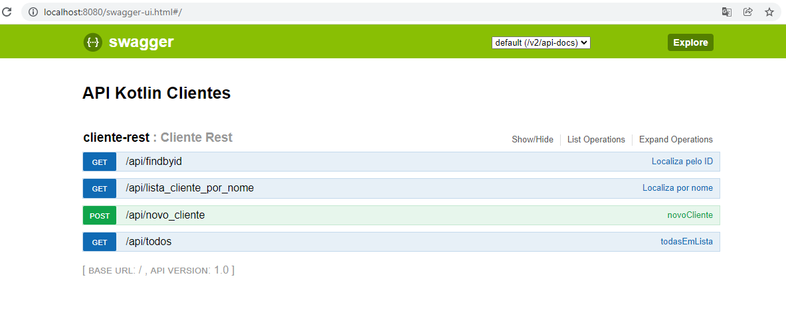

# KotlinHexagonalBackEnd
Projeto para teste de arquitetura hexagonal com Kotlin.   
*Autenticação via Interceptor .  
*Listagem com filtros especificos.   
Requisitos:  
*MongoDB  
*Java11  
*Maven  

  
-Swagger: http://localhost:8080/swagger-ui.html
 
  

<h3> Segue os exemplo de curl das funções do microsserviço</h3>
 
[POST]  
curl --location --request POST 'http://localhost:8080/api/novo_cliente' \
--header 'Authorization: MTIzNjU0Nzg5' \
--header 'Content-Type: application/json' \
--data-raw '{
"nome":"teddy teste",
"idade":33,
"contatos":[
{"fone":"9997712985"},
{"fone":"9997712985"}
],
"enderecos":[
{"rua":"rua teste",
"numero":123,
"tipoMoradia":"A"}
]
}'
  
[GET] - FindAll  
curl --location --request GET 'http://localhost:8080/api/todos' \
--header 'Authorization: MTIzNjU0Nzg5' \
--data-raw ''

  
[GET] - FindByID  
curl --location --request GET 'http://localhost:8080/api/findbyid?id=61329ed4d966a6130dc717d4' \
--header 'Authorization: MTIzNjU0Nzg5' \
--data-raw ''
  
[GET] - FindByNome  
curl --location --request GET 'http://localhost:8080/api/lista_cliente_por_nome?nome=t' \
--header 'Authorization: MTIzNjU0Nzg5' \
--data-raw ''
 
